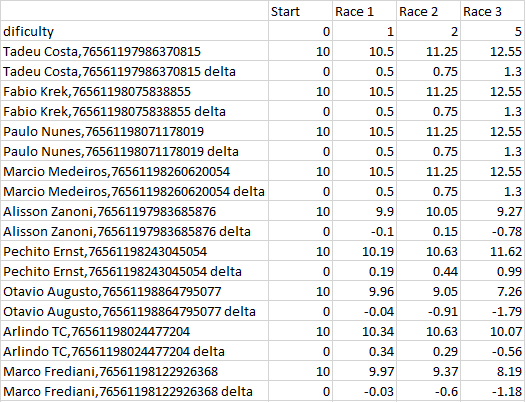

.. AMS_Safe_Rating documentation master file, created by
   sphinx-quickstart on Wed Jun  5 13:06:25 2019.
   You can adapt this file completely to your liking, but it should at least
   contain the root `toctree` directive.

Game Automobilista (AMS) Safe Rating Calculator
=================================================

:Author: Ramon Pinto de Barros
:Version: 0.0.1
:Copyright: MIT License

.. contents::

The text below contains the documentation for a very simple - yet
important - script that a simracing league manager may use to
Penalize, Reward or monitorate Drivers over their behavior on track.

__
.. _Quick reStructuredText: quickref.html

.. Note:: This script had been used on my personal project named
  Simracing Valley. It was a player aggregator in which people could
  find free online races with strict rules and moderation. 
  The Safety Rating Calculation was an important tool to do a 
  crystal-clear moderation to all drivers.  
  The `Introduction`_ section below has more information on it.

Introduction
------------
Sometimes it may be hard for Competition Managers to judge the conduct of
Simracers on track. There are many reasons (and excuses) for a Driver
to be unfair on the track and a Safety Rating (SF) rule may be very
useful to diminish the amount of incidents in a race.

There's a very important parameter that no Simulator can simulate
properly. Fear! Simracers have no \"fear\" of having the car damaged 
or their lives at risk.

On that account, many Simracers may lose their sense of responsibility
when in overtaking/defending maneuvers, generating silly incidents
that sometimes might become \"Big Ones\". Those incidents may turn
the race unpleasant and frustrate those who are dedicated simracers.

The Safety Rating Rule is one way of handling with non-responsible
drivers. The `iRacing`_ Simulator uses a Safety Rating rule and there are
many advantages that they obtain from it. EG. the avoidance of having online Marshalls 
for every race and also the possibility for the iRacing non-official 
Competitions to disqualify racers that surpass a delimited amount
of incidents in a single Race.

**Altough this script was based on how iRacing calculate their SF, there**
**are many restrictions to what can be done for Automobilista**. Anyways,
this script has been used satisfactorily and it's important to point
the reasons why:

* Drivers can see if their SF is good or bad and change it's behavior from race to race. 
* Drivers can see each others SF and avoid (or try to avoid) bad rated drivers.
* The rule *simulates the fear* of having a bad reputation on the community. 
* The rule can be used to disqualify, penalize or monitorate drivers that are having bad rating.

Further explanation over how it works is done in the next section.

.. _iRacing: https://iracing.com

How the Safety Rating Script works
----------------------------------

.. Note:: This is a Python 3 script, and so it needs a Python 3 interpreter to be run.

.. Note:: I've added a .exe for windows in the folder "exe", but it has been being tested! Try it as you wish!

This script collects data from the server .xml file and turn it into
numbers of incidents, saving it on a .csv database that can be used
for further deployment of data.

Differently from iRacing SF calculations, in which are accounted the off-tracks
and spins, **this script takes in account only the damage that is done on *car-car* and *car-immovable* incidents.**

Also, differently from iRacing SF - that sums the rating improvement for each turn 
done in a track, the AMS Safe Rating script asks the manager if the computed data is from a
track in which big incidents are **mostly common** (*Dificulty Level 5*) from those in which big incidents are **Rarely Commom** (*Dificulty level 1*). Further information can be found in the `How to generate Safe Rating databases`_ section.

So, a list of what you need to run this script after your competition's race is:

* A Python 3 interpreter
* **This script installed**
* .xml files inside a \"\\LOGS\" directory
* Microsoft Excel or any other Sheets software to open the .csv files.

Possibilities and known restrictions
------------------------------------

1. **There's no way this script can do a presumption of guiltiness.**
	- Sometimes a driver has no guilt on a situation and its SF can be demolished by it. The league manager **MUST** create rules for further decision when responsibility is inputed to a competitor.
	- *At Simracing Valley I chose to let the numbers \"as is\" so drivers created a feeling of community and guiltiness for each others bad results. This might not work well for very tough competitions.*
2. This script can **ALREADY** generate much more than the Safety Rating. Improvements is being done right now when you read it. If you want to collaborate, follow us on our `github`_ repository!
3. Drivers that **DNF or DNS** a race and are present in the LOG File receives Safe Rating Points as they were in the race (This will be improved in the next version).
4. The parameters for calculations can be changed (*if you know a few of Python*).
5. There's no \"automatic data publishment\" in this script. Managers must read the .csv file and find out what's the best way of publishing it.
6. All .xml files that has being used for this script were RACE logs. I don't think there's a point on calculating safety rating for *Private Qualifying sessions* or *Practice sessions* at all. (Maybe we can change it!)
7. The driver is identified by its **driver profile name** and its steamID number. **Managers can use this identification to find irregularities** (Eg. A driver racing for another driver!)

.. _github: https://github.com/rmlz/automobilista-safe-rating

How to install AMS Safe Rating
------------------------------

First of all you will need to install a Python >=3.6 interpreter. You can download it from the link below:

`Python official download page <https://www.python.org/downloads/>`_

Next, you can install **AMS Safe Rating** directly from a clone of our `github`_ repository. This also can be done by installing via **git**.
:: 
    \$ git clone https://github.com/rmlz/automobilista-safe-rating.git
    \$ cd automobilista-safe-rating-master
    \$ pip install .
  

There's some example .xml and .csv files on the git repo. How it's used and generated will be shown in the `How to generate Safe Rating databases`_ session.

Once you completed the steps above, make sure you create a directory and that it contains the subfolders:

* \"\\LOGS\",
* \"\\DB\",
* \"\\DB\\BACKUP\"
* \"\\OUTPUT\"

Everything done! All you need to do is to create a .py file and go to the next session!

.. Note:: **You can use the content inside the \"example\" folder and substitute files for your own ones!** The run_safe_rating.py file is ready to use and all you need to do is to run it on the Py Interpreter.

How to generate Safe Rating databases
--------------------------------------

Before you run your .py file or the example file run_safe_rating.py, make sure there are
AMS log files inside the LOGS folder.

Once you run the .py file a message will be prompted telling you to choose the logfile (.xml)
that you want to be used in the calculator:
::
 C:\Safe rating\example> python run_safe_rating.py
 "Welcome to the Safe Rating Calculator for Game Automobilista's LOG Files."
 '@author: Ramon Pinto de Barros'
 '@version: 0.0.1'
 '@license: MIT License'
 ----------
 [('FILENAME', 'FILENUMBER'),
 ('2018_12_16_20_57_58-62R1.xml', 1),
 ('2018_12_21_21_08_43-59R1.xml', 2),
 ('2018_12_26_22_24_02-87R1.xml', 3)]
 ----------
 Select one of the log files above
 Input Filename or filenumber:_

**Its VERY IMPORTANT that the file name finishes with "R1.xml"**

There's 3 .xml files inside the *\"example\\LOGS\" folder*. You can either input the name of the file or the number related to it. Once you select the file and press enter a new message
will be prompted:
::
 Input Filename or filenumber: 2
 The file 2018_12_21_21_08_43-59R1.xml has been found
 Track dificulty level (1-5):_

The track dificulty level sets how many points a driver may receive after a clean race. The
list below is **ONLY A SUGGESTION** of how it should be applied.
Each manager shall decide how the levels might be used. One may decide that all the tracks
must be in the same level of dificulty (also drivers will receive the same amount of point for
a clean race). 

**I ALSO SUGGEST** that a discussion between drivers and race director should be done to classificate each 
of the tracks used in a Competition Season:

+ Level 5 Incidents are **Mostly common** to happen. 
	- Might be used for tracks where cars usually touches each others or walls.
	- Big ones might happen once or twice in a regular race.
	- Examples: Street tracks, Super Speedway Ovals
+ Level 4 Incidents are **Generally common** to happen.
	- Might be used for tracks where cars generally touches each others or walls.
	- Big ones might happen once (or never happen), but the speed of the cars let drivers avoid big crashes.
	- Examples: Slow street tracks, Slow Ovals
+ Level 3 Incidents are **Sometimes common** to happen.
	- Might be used for tracks where cars sometimes touches each others or walls.
	- These tracks are generally okay, but may contain some safety issues in some of its turns.
	- Example: Old tracks that haven't been modified for modern safety standards.
+ Level 2 Incidents are **Occasionally common** to happen.
	- Might be used for tracks where cars sometimes touches each others but almost never touches walls.
	- These are standarized tracks with very few overtaking points.
	- Example: Some FIA Grade 1 Licensed Circuit
+ Level 1 Incidents are **Rarely common** to happen.
	- Might be used where there's plenty of space for maneuvers. There are many overtaking points.
	- These are tracks with high safety standards.
	- Example: Some FIA Grade 1 Licensed Circuit

A driver receives points based on track level and how many incident points they generate.
The equation is really simple (**Driver points = Previous points + Track level points - Incident Points**), and every
driver starts a Season with **10 Safe Rating points**. This amount might be enough for two
very bad races (EG. Gets car or main parts of it destroyed). 

When a driver hits another driver, both of them generate incident points for each other, and
when a driver hits a wall, he/she generates points for him/herself. Sometimes a driver may
knock another offtrack inducing his rival to generate more points (crashing over a wall).
**The MANAGER must edit explicit rules for this kind of situation,** to protect drivers.
Also, Explicit rules for drivers that lose all points getting zero, or negative Safety Rating points are needed!

After selecting the dificulty level, a new message will be prompted:
::
 Track dificulty level (1-5): 2
 The track dificulty level was set to: 2
 NO DATABASE FOUND IN THE DB DIRECTORY.
 CREATING NEW DB:
 Select the name for your DB:_

Now you will create your DATABASE. I suggest you use a good identification name (LeagueName_Season1_2019).
But the manager can input any name he wants. **If there's one or more DB's in the DB folder, the message**
**will be slightly different**:
::
 Track dificulty level (1-5): 2
 The track dificulty level was set to: 2
 You can create a new DB file, or use an existing one.
 Do you want to create a new DB??

Just answer Y to create a new DB, or N to continue using an existing DB.

In this example I created a DB for my hipothetical league named MLS in its Season 1 of 2019.
The DB name is: *MLS_S1_2019*
::
 Select the name for your DB: MLS_S1_2019
 Database "MLS_S1_2019.csv" was correctly created
 adding data to the Database
 The session had 10 total players
 Reading the XML...
 Reading Positions....Done!
 Reading Drivers names, Done!
 Reading drivers ID......Done!
 Starting to Read Drivers Laps!
 Reading Drivers laps.........Done!
 Race Session, driver Status, Done!
 Retrieving Session incidents...
 ...
 Putting all together into the Race Result...
 Database "MLS_S1_2019.csv" is being defined
 Incidents, Done!
 ------------------------

And that's it! You have a new DB with the safety rating data for the selected race.
For adding new races to the DB, all you need to do is to select it when prompted in the interpreter.
::Note
  Everytime a DB is changed, a Backup copy is generated in the \"DB\\BACKUP\\\" folder!
  A manager might use that as backup information for the competition.

A .csv database might look like this one:

* Drivers are identified by their profile name and steamID.
* All drivers start with 10 Safe Rating Points.
* Clean drivers receive points based on Track Dificulty parameter.
* Points increase or decrease based on drivers incidents damage (more damage, more points).
* Table shows points records and the difference (delta) between the very previous race points.
* Drivers that doesn't attend races keep their points unchanged
* Drivers that DNF or DNS and are present in the LOG File receives Safety Rating Points as they were in the race.
	+ *This will be improved in the next version*.

Last Words and Thanks
---------------------
I hope this script will be useful for competitions as it was for me. **If you want to collaborate and/or suggest **
**modifications and improvements**, you may find me on the `github`_ repository.

I'm a Python student that have been trying to create useful scripts for the Simracing Community.
Also I may thanks all the people that helped me to develop the Simracing Valley Community:

* Alisson Zanoni
* Aparicio Felix Neto
* Aurea Barros
* Carlos Eduardo Pinto
* Celso Pedri
* Cesar Louro
* Fabio Krek
* Fernando Bueno
* Glenio Lobo
* Gracas Barros
* Gustavo Pinto
* Hernani Klehm
* Iovan Lima
* Maikon Sulivan
* Matheus Manarim
* Nicolas Sanchez Ernest
* Pedro Phelipe Porto
* Rodrigo Lepri
* Rodrigo Vicente
* Tadeu Costa
* Tayane Campos

Functions
----------

.. py:function:: calculator()

   Core routine function for calculation of the Safety Rating points.

Usage: Starts the calculator routine.

>>> from ams_safe_rating import calculator
>>> calculator()

.. py:function:: xmlreader(database_path, result_file, db_file, track_dificulty)

   Reads the AMS .xml result_file, save it to the database on database_path\\db_file and return a Pandas dataframe
   containing the new data.

Usage:

>>> from ams_safe_rating import xmlreader
>>> PATH_CONFIG = {
>>>  'logs': 'LOGS\\',
>>>  'database': 'DB\\',
>>>  'backup': 'DB\\BACKUP\\',
>>>  'output': 'DB\\OUTPUT\\',}
>>> resultfile = 'example_R1.xml'
>>> dbfile = 'example_2019.csv'
>>> xmlreader(PATH_CONFIG['database'], resultfile, dbfile, 2)

This will save data into example_2019.csv and return a dataframe of its data.

.. py:function:: createdb(db_path)

   Simple function that creates a .csv Database in the db_path

Usage:

>>> from ams_safe_rating import createdb
>>> PATH_CONFIG = {
>>>   'logs': 'LOGS\\',
>>>   'database': 'DB\\',
>>>   'backup': 'DB\\BACKUP\\',
>>>   'output': 'DB\\OUTPUT\\',}
>>>
>>> createdb(PATH_CONFIG['database'])

This will return a prompt message in which you will be able to input information to create a DATABASE into
db_path directory.

